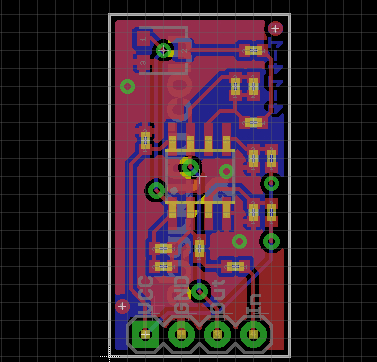
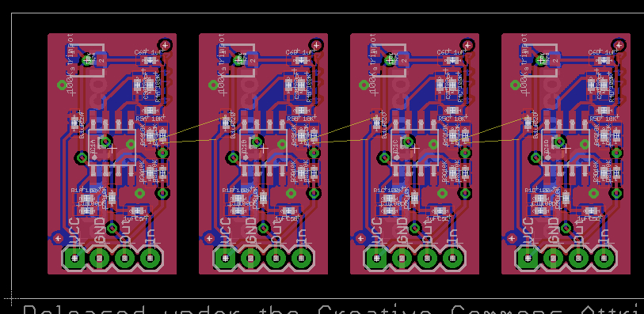
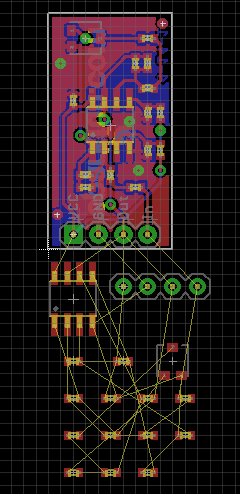
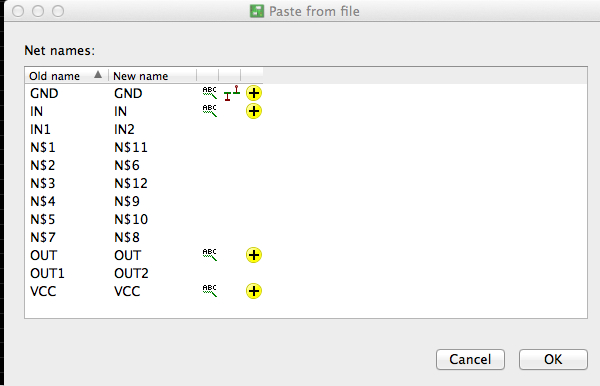

eagledroppings
==============

Useful utilities from Landon Cox / Inhale3D.com to use with CadSoft Eagle PCB Design Software.
Apache Open Source License.  Landon Cox, elandon at esawdust.com

eagleclone
----------
To start things off, I'm introducing, eagleclone, a utility that lets you clone or replicate a 
board and schematic such that it can be imported multiple times into a design without
having to tediously fix-up all the nets, component names, and everything else to create
a new instance of the module within your design.  

Visually, it lets you take a schematic and board layout and clone it as many times 
as you would like.  Using a Sparkfun OpAmp breakout board as an example (design released 
under Creative Commons), turn a single design:



into multiple instances on the same board:



where all you have left is to route the design into the master board design (route airwires.)

For me, I find it easier to layout a board by laying out modules like this first and providing
consistent entry or exit points on the module and cloning when I need multiple instances. The 
resulting boards tend to be more consistent. Hand assembling the boards is faster as well
because of consistent placement.

Alternative
-----------
In EAGLE, you can copy and paste a design or portion of a design from the schematic view, but
you end up with a pile of parts on the board layout that you have to layout again:



That's clearly not useful. In EAGLE, you can also import a board file to try to make multiple
instances of a layout, but that results in having to rename all the nets and components.
When you import another EAGLE drawing, you have to "Fix up" all the old and new names
manually.  In the case of importing the OpAmp breakout a second time, some of the net names
need to remain the same (power), and some have been changed automatically, and some 
need to be made unique.



This gets you part of the way to a cloned design, but if the original design changes, or you
import the design more than once, you have to go through this process for each instance which is
also not very productive.

Eagleclone deals with this stuff for you, so after you import a clone, there's no re-mapping
of pins and parts to do - eagleclone has already renamed everything.

Use Cases
---------
Imagine you're designing a multi-port circuit board, say multi-input amplifier, so you 
start by designing a single channel, schematic, and board layout for that channel. 
Now, you can use eagleclone to make as many instances of this design as you want 
where an instance includes both schematic and board layout, but each instance is 
uniquely named so each channel doesn't conflict with the other when you import it into
your master design.
With EAGLE, if you copy and paste the schematic parts, you'd end up with a heap of parts in
the board layout that you would have to layout again.  Alternativley, in the board, 
if you copied your layout, you'd be required to rename all the components and nets. Either
way, EAGLE just doesn't clone sub-systems very well at all. 

Another reason cloning the design like this is nice is if you need to make 
a change to the schematic or board layout, you can do it in the original module, reclone and 
import them.  In other words, with EAGLE, if you have to tediously fix up nets and part names
after importing a design, you're likely not to do it again if you need to change it, so you
either don't change it, or you change it in the derivative work, but not the reusable module,
or you spend a lot of time re-fixing the nets.

But with eagleclone, you can simply clone your sch and brd files as many times as needed
and create an 8-port hub without having to interact with EAGLE's net-renaming, component renaming
dialog box for every wire in your design.

This is similar to but a little different than panelizing a design. eagleclone is really 
for taking a fragment of a design, say an amplifier design and creating multiple channels
each with its own amplifier instance.  

What is missing from EAGLE (the EAGLE dropping) is the ability to simply copy and paste 
a selected portion of a design in a way that pulls through all the components, nets,
pins, and board layout for that part of the design.

You can import a design into Eagle but if it's the second instance of the design, you're
forced to rename all the components and nets to not conflict with those already there.  This is 
obviously a very tedious and error-prone process and is what eagleclone alleviates.

In short, eagleclone, creates multiple instances of a particular layout so you don't 
have to re-layout the same module multiple times or fuss with renaming through the EAGLE
import dialog box.

Since version 6 of EAGLE, the board (.brd) and schematic (.sch) files have been stored in
XML format.  This utility assumes you have EAGLE 6 XML design files.

Prerequisites are: 
1) Ruby 2.0.0 
2) EAGLE 6.x .brd and .sch EAGLE file of the design you want to replicate.  
3) Nokogiri

Example usage
-------------

```bash
$ ./eagleclone.rb --help

Usage: eagleclone -d design_to_clone -p clone_postfix
    -d, --design DESIGN              specify design file without file extension
    -p, --postfix POSTFIX            specify the postfix to append to all parts, signals, etc
    -h, --help                       Show this message

```
Assume you have an EAGLE design called 'test' and the two EAGLE files are 'test.brd' and 'test.sch'
for PCB board and schematic, respectively.  You can create new three new instances of this design 
called A, B, and C, as follows:

```bash
$ ./eagleclone.rb -d test -p A
$ ./eagleclone.rb -d test -p B
$ ./eagleclone.rb -d test -p C
```
This creates three new instances of the test design that are 'A', 'B', and 'C' instances of the original design:
```bash
testA.brd
testA.sch
testB.brd
testB.sch
testC.brd
testC.sch
```

The files are created in the same directory in which the original design exists.  The original design
is never modified and eagleclone is idempotent (it will overwrite any files previously generated by
eagleclone.) At this stage, you have three new designs, each uniquely named 

To use these replicated designs:

1) In EAGLE, you would load up the master design into which you want to import these instances, then
switch to the board layout view of that design. 

2) File->Import each of the .brd files above for A, B, and C respectively
2a) When you import a design it lets you place it somewhere on your board layout much as if 
you were placing a component on the board, but you can place the entire imported design instead.
2b) Notice that when you import the .brd clone, its schematic comes right along with it as a 
new sheet in your design which is nice to keep the instances all separated and easy to manage 
within EAGLE.

3) Route your board normally from there.  It's useful to provide some connection points on 
your sub-module in the board layout before you clone it - just makes it somewhat easier to 
treat each module like a self-contained layout you just need to hook up to the rest of your design.

How it works
------------

eagleclone uses Nokogiri, a Ruby gem which knows how to read and write XML files, to ingest the
EAGLE board and schematic files.  Then using XPath queries, it identifies all the nodes in the XML
files which need to be renamed or replaced with new instance names derived from the original name plus
the instance parameter given by the -p option on the command line.

It then replaces the names and writes out a corresponding .sch and .brd file that has the new 
instance information in it.  The new file is effectively a completely independent design.

Caveats
-------
eagleclone looks for certain power supply-related signals such as 3.3V and GND and does not replace
those.  It's assumed each design derived from the original will use the same power and ground signals
as the original design.  This makes the instances easier to import and requires no fixup after import.

Installation on OS X or Linux
------------------------------

Prerequisites are simply Ruby 2.0 and the Gems specified in the gemfile.
Currently developed and tested on OS X and Linux.  Should work
under Cygwin on Windows, but not tested.

The easiest way to install ruby is to use RVM:  https://rvm.io
```bash
$ \curl -L https://get.rvm.io | bash -s stable
$ source ~/.profile
$ rvm install 2.0.0
```

Then from the directory in which you installed eagleclone, install the requisite gems
for eagleclone:

```bash
eagleclone $ bundle install
```
to install the prerequisite gems.

RSpec tests have been provided if you want to run those to insure you have everything 
installed correctly and the eagleclone utility is working properly.

Run rspec by itself on the command line and the tests will run.  If you see '0 failures'
you know you're good to go.

```bash
eagleclone $ rspec
....................

Finished in 0.48173 seconds
20 examples, 0 failures
```

TODO
----
1) Make eagleclone a gem.
2) Add feature to clone one design multiple times into one file (vs one file per clone.)


Apache Open Source License
--------------------------
Copyright 2013 Landon Cox

   Licensed under the Apache License, Version 2.0 (the "License");
   you may not use this file except in compliance with the License.
   You may obtain a copy of the License at

       http://www.apache.org/licenses/LICENSE-2.0

   Unless required by applicable law or agreed to in writing, software
   distributed under the License is distributed on an "AS IS" BASIS,
   WITHOUT WARRANTIES OR CONDITIONS OF ANY KIND, either express or implied.
   See the License for the specific language governing permissions and
   limitations under the License.
